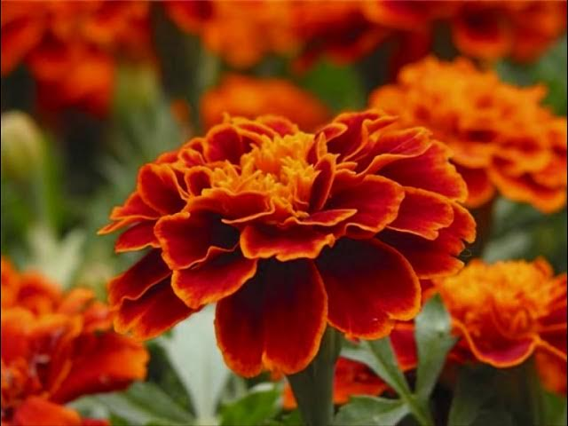
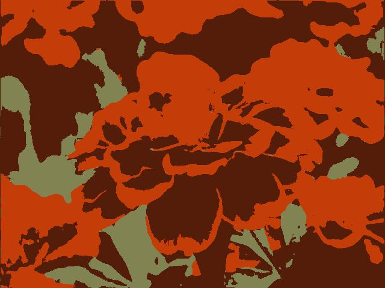
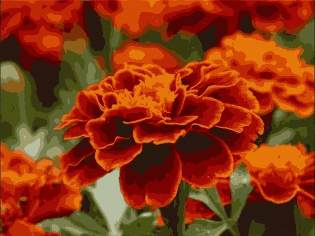
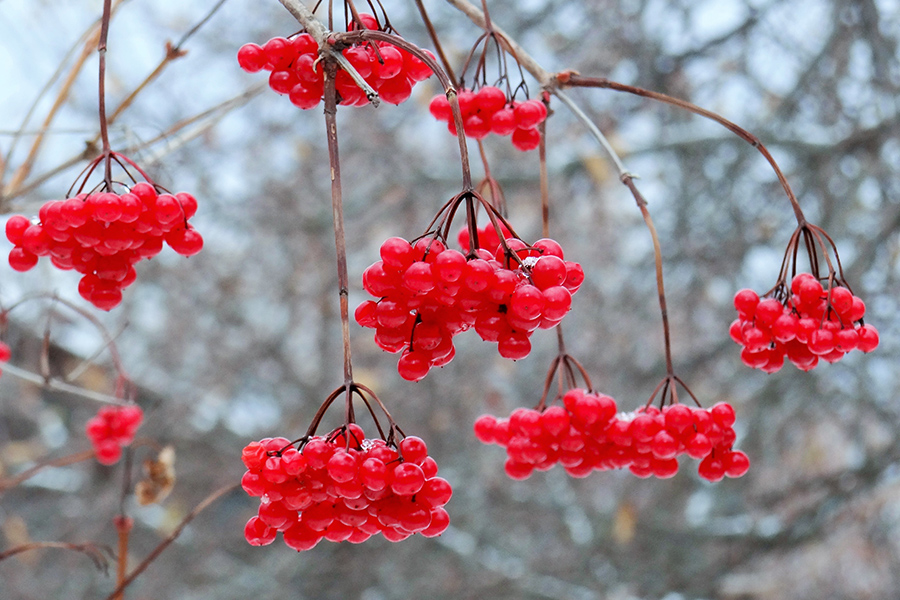
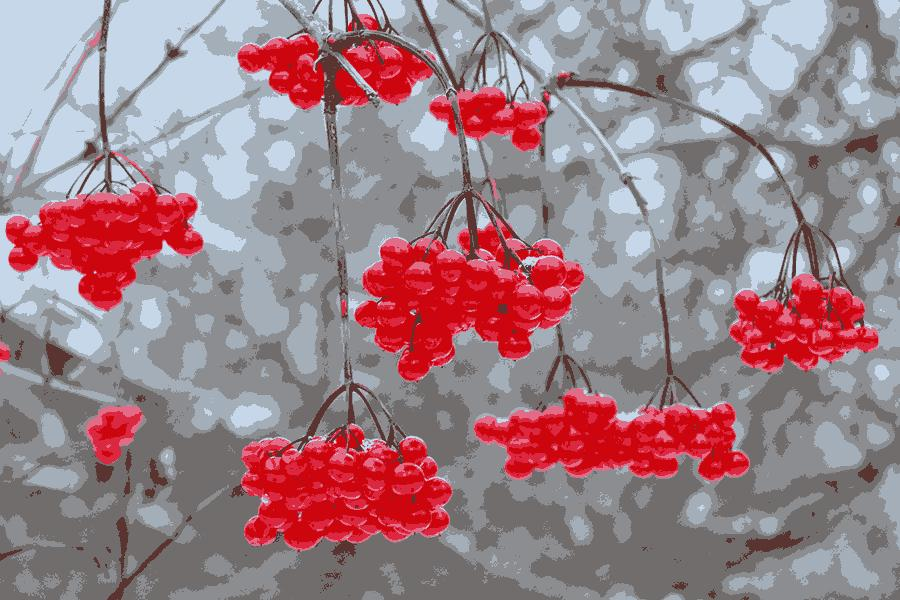

# Image colors simplifier 🍭
This script (which maybe extended to a form of a simple application)
can simplify colors in an image to exactly n colors which can be set as
```clusters_number``` in the ```simplificator.py``` 🐍 file.

To run the script set path to the file in ```simplificator.py``` and run
the file itself.

The script is written not using any scientific or ML libraries so there is a high
probability, that you won't need to install any dependencies, but they
are still provided in ```requirements.txt``` file.

## 📽️ Demo 📽️

### example 1 - Tagetes
### original



### 3 colors




### 8 colors


### 16 colors



### example 2 - Viburnum
### original



### 8 colors



## Applications and remarks

Why would one need it? I thought it might be useful for example for pixel- or minecraft art
where we have very limited color palette. Another idea is to use it with screens with limited amount
of available colors.

This is the first version of the project it will be optimized over time
and might evolve into an application getting an interface

